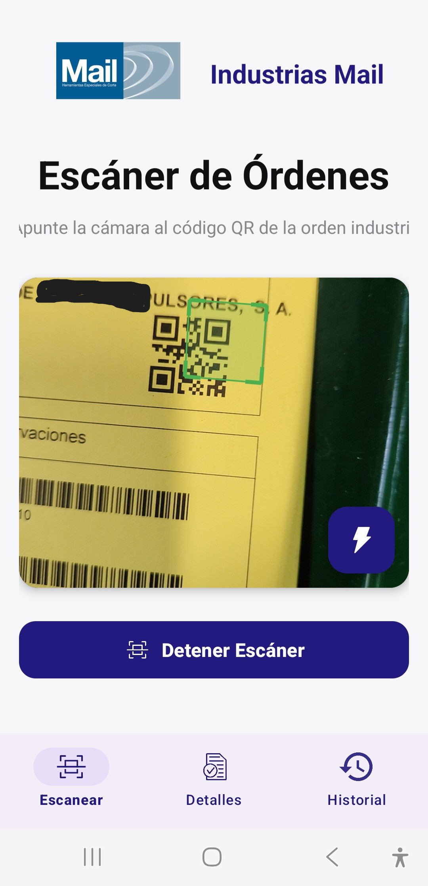
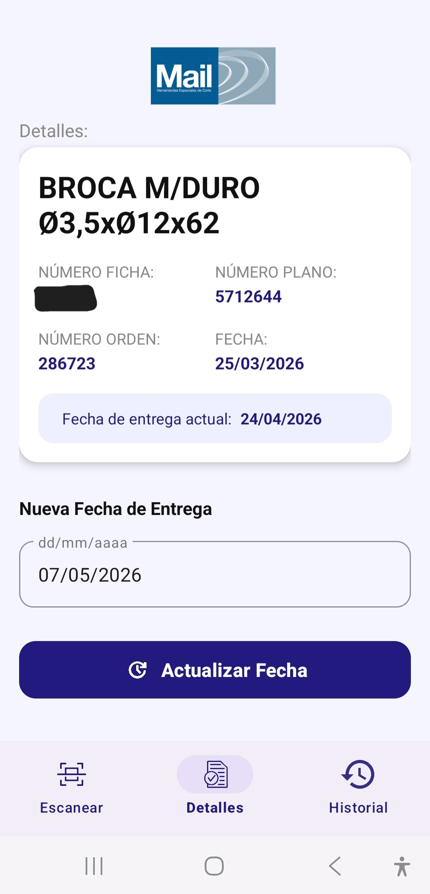
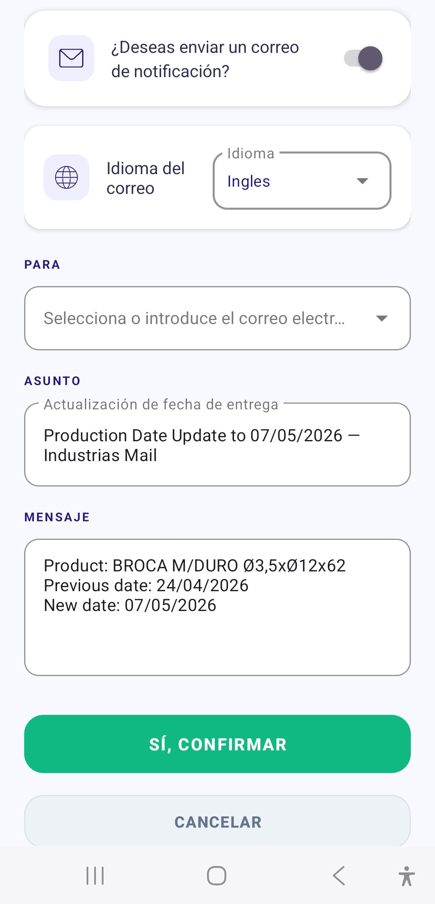
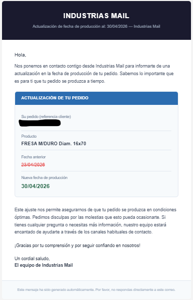
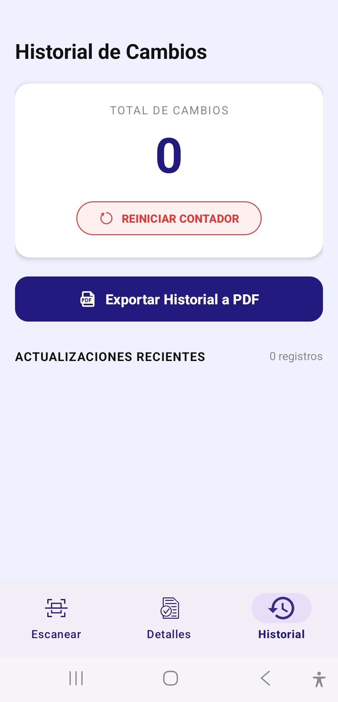

# Order Scanner — Industrias Mail

Android application developed for **Industrias Mail** to streamline communication between the production department and clients whenever a delivery date change occurs on a production order.

> For security reasons, the source code of this repository is private and not publicly available.

---

## The problem it solves

When a production order was delayed, the usual process of notifying the client was entirely manual: someone had to look up the order details in the ERP, write an email and send it. This was slow, relied on a single person and left room for mistakes and oversights.

This application allows any floor operator, at the moment they detect the change, to handle it and notify the client immediately, directly from their phone and without needing to access a computer.

---

## How it works

The application has three main sections accessible from the bottom navigation bar.

**Scanner**

The operator opens the app and points the camera at the QR code on the physical label of the production order. The app recognizes it automatically and instantly loads the order details from the internal ERP system.

  

**Details**

Once the order is scanned, all relevant information is displayed: the product name, internal reference numbers and the delivery date currently recorded in the system. From this same screen the operator enters the new delivery date and taps the button to proceed.

  

Before applying the change, a confirmation screen appears where the operator can enable or disable the sending of a notification email to the client, choose the language of the email (Spanish, German, French English and Basque), select the recipient's email address and preview the message that will be sent, including the product name, the previous date and the new date.

  

Once confirmed, the date is updated in the ERP and, if enabled, the email is automatically sent to the client.

  

**History**

The application keeps a record of all changes made during the session, including the product name and the dates involved. From this screen the operator can export the full record as a PDF and reset the counter to start a new session.

  

---

## The API

Alongside the app, a custom API was developed to act as a bridge between the mobile application and the ERP database. It handles querying order data from the QR content, applying date changes to the system and managing the sending of notification emails to clients.

---

## Context

This project was developed entirely by a single developer for **Industrias Mail**, as part of an effort to digitize and streamline production-to-client communication processes.
